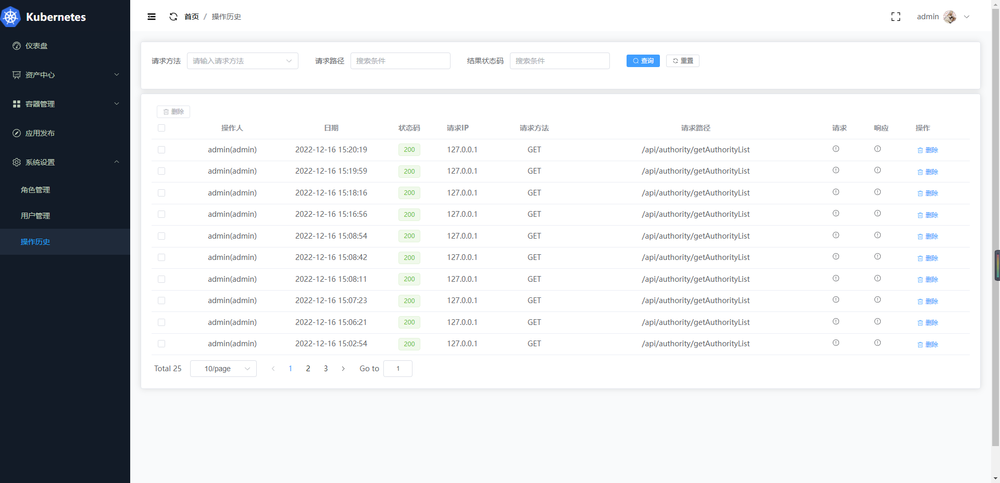
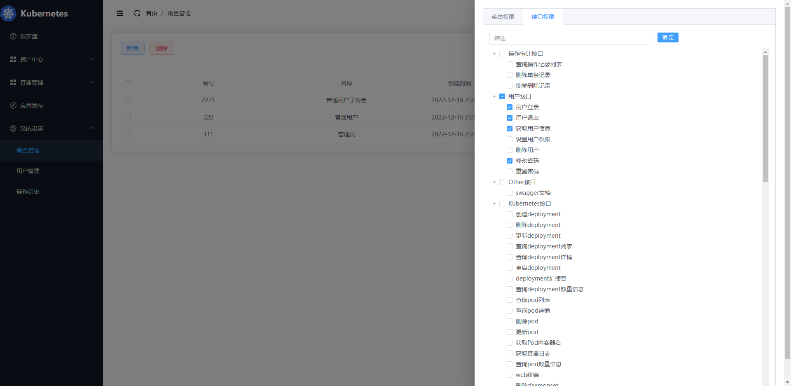
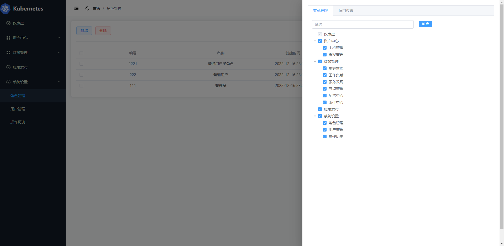
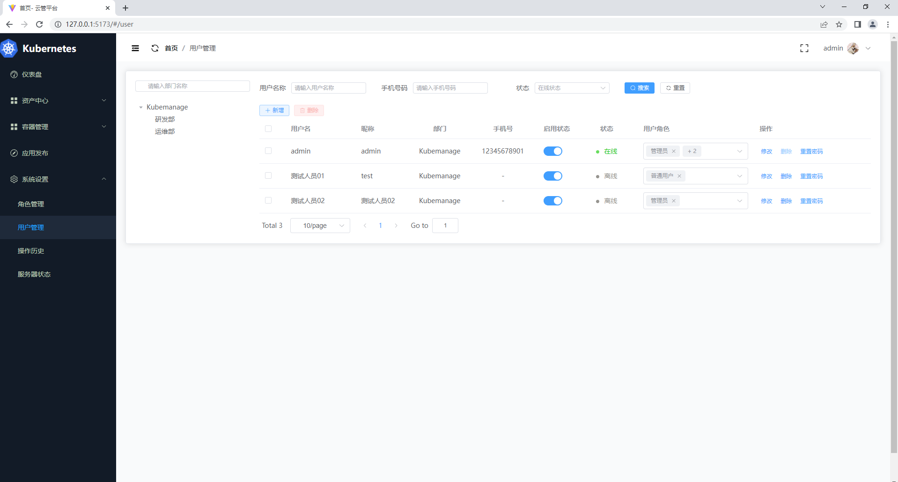
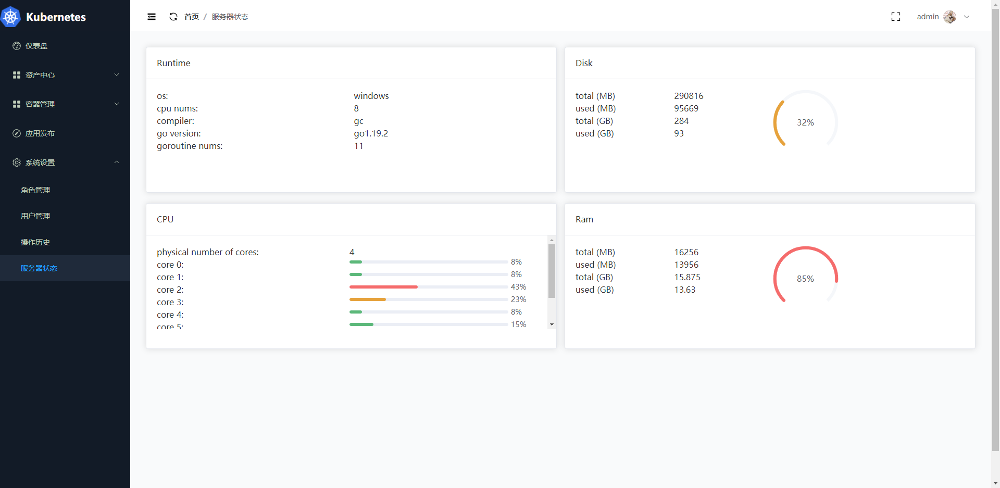
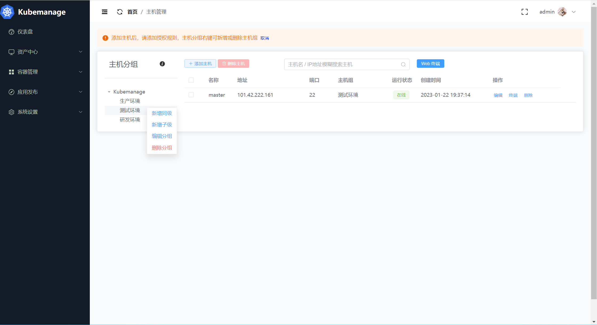
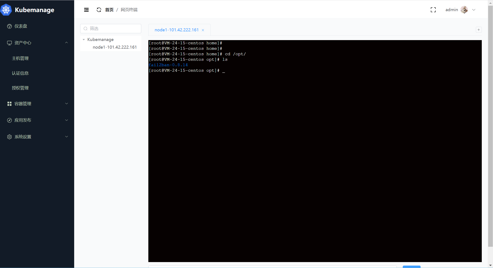

简体中文 | [English](./README_en.md)
# kubemanage
<p >
  <a href="https://golang.google.cn/">
    
  </a>
  <a href="https://gin-gonic.com/">
    
  </a>
  <a href="https://gorm.io/">
    
  </a>
  <a href="https://vuejs.org/">
    
  </a>
</p>

> kubemanage是一个简单易用的K8S管理平台，前端使用vue3，后端使用gin+gorm,对于初学k8s开发的同学来说，是一个很方便练手的项目，也可以作为企业二次开发的模板

技术栈选型当下最主流框架，后端使用Gin+GORM，前端使用vite+pinia+VUE3(v3版本)开发，前后端分离开发模式，使用client-go与K8S交互，使用Casbin与动态路由实现RBAC的权限体系

前端项目地址 https://github.com/noovertime7/kubemanage-web

V3版本前端项目地址(开发中) https://gitee.com/noovertime/kubemanage-web.git
## 开始部署
### 初始化数据库
需要手动创建数据库，数据表与数据会通过`DBInitializer`自动初始化

```sql
CREATE DATABASE kubemanage;
```
### 运行工程
前端
```shell
git clone https://github.com/noovertime7/kubemanage-web.git

cd kubemanage-web

npm install

npm run serve
```
后端

注意：请确保用户名/./kube  文件夹下存在k8s的kubeconfig文件，后面重构为多集群注册模式，容器部署,前端使用V3版本，后端请切换到V3分支

开始前请设置配置文件环境变量`KUBEMANAGE-CONFIG`，或通过命令行参数`configFile`指定，配置文件优先级: 默认配置 < 环境变量< 命令行

```
git clone https://github.com/noovertime7/kubemanage.git

cd kubemanage

go mod tidy

go run cmd/main.go
```
默认用户名密码 admin/kubemanage

## 现有特性

- 支持RBAC的权限管理，根据角色配置菜单权限与接口权限
- 支持资产管理，多主机同步连接，互不影响
- 本地Kubernetes集群的管理
- 接口调用操作审计功能

## Roadmap

- 支持多集群管理
- 支持应用一键发布
- 在线工单审批系统

## Issue 规范
- issue 仅用于提交 Bug 或 Feature 以及设计相关的内容，其它内容可能会被直接关闭。

- 在提交 issue 之前，请搜索相关内容是否已被提出。

## Pull Request 规范
- 请先 fork 一份到自己的项目下，在自己项目下新建分支。

- commit 信息要以`feat(model): 描述信息` 的形式填写，例如 `fix(user): fix xxx bug / feat(user): add xxx`。

- 如果是修复 bug，请在 PR 中给出描述信息。

- 合并代码需要两名维护人员参与：一人进行 review 后 approve，另一人再次 review，通过后即可合并。

## 生成APi文档

使用swag生成api文档

PS: 请使用最新版本的swag工具，建议拉取最新代码后自行编译，否则会`swag init`初始化失败

```shell
swag init --pd -d ./cmd,docs
```

成功生成后访问 `http://127.0.0.1:6180/swagger/index.html`

## 效果演示

集群详情(v3版本)


首页


操作审计(v3版本)


接口与菜单的RBAC控制(v3版本)



用户管理(v3版本)


服务状态(v3版本)


CMDB主机管理(v3版本)


CMDB网页终端(v3版本)


工作流


deployment


pod


POD日志


POD终端


service


configmap


node

